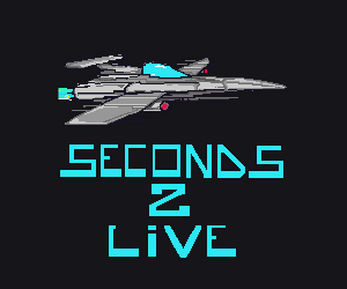

I participated in a 48 hour game jam which is a competition where one has to create an entire game within the time limit. I worked with two other people during this game jam. We created the game using Unity which requires programming in c#. The game is called Seconds 2 live which is a 2D platform where you help the victim of a space crash and his sidekick ostrich collect parts to repair their ship. One must be careful due to the different atmosphere, as you can only survive for two seconds before you need to repressurise your suit. 

All art, music and game mechanics made in 48 hours with the exception of the font which was purchased from the Unity Asset Store

[Seconds 2 Live](https://puddleinteractive.itch.io/seconds-2-live)
